# Frontend CRM Outreach

A polished, modern CRM outreach experience built with Next.js, React, Tailwind CSS, and GSAP. This project brings together a marketing website, authentication flows, and a full-featured dashboard for [...] 

<p align="center">
  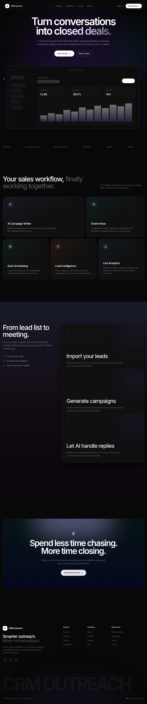
</p>

## ▶️ Video

GitHub README files do not allow <iframe> embeds for security reasons. To keep the video visible from the README, the recommended approach is to use a clickable YouTube thumbnail that links to the video page.

[](https://youtu.be/ynkMrjhZme4)

If you want an embedded player, add the iframe to your deployed website (Next.js pages, GitHub Pages, or other HTML pages). See the "Embed on your site" section below for a responsive Next.js component.

## 📸 Screenshots Gallery

### Marketing Pages

<div align="center">
  
  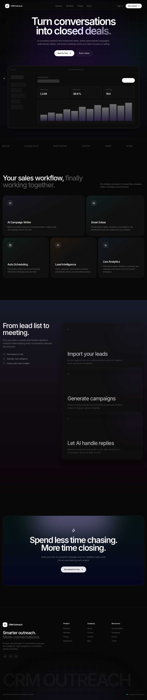
  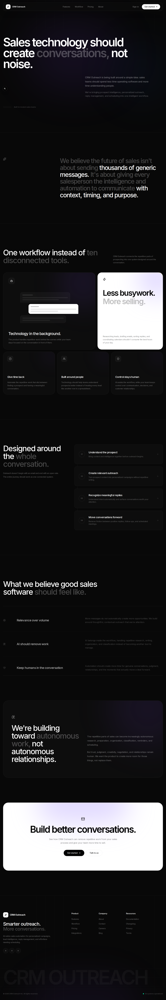
  <br />
  
  
  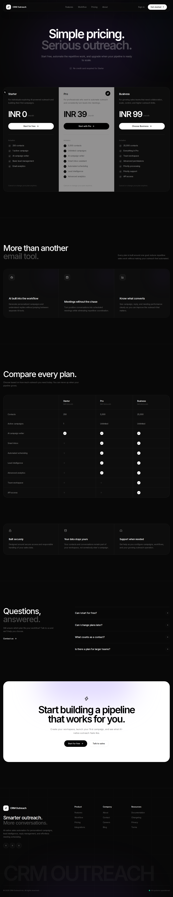
  <br />
  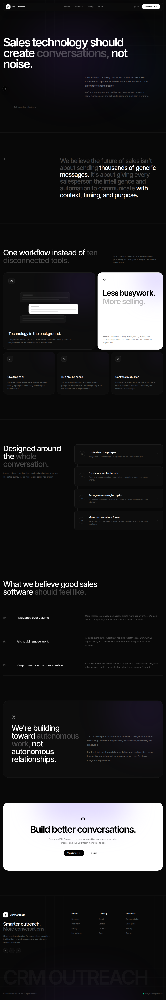
  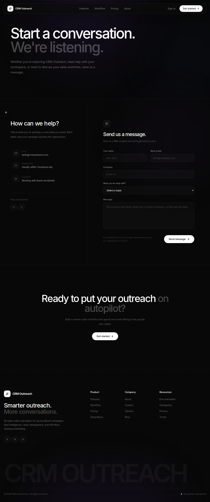
</div>

### Authentication Flow

<div align="center">
  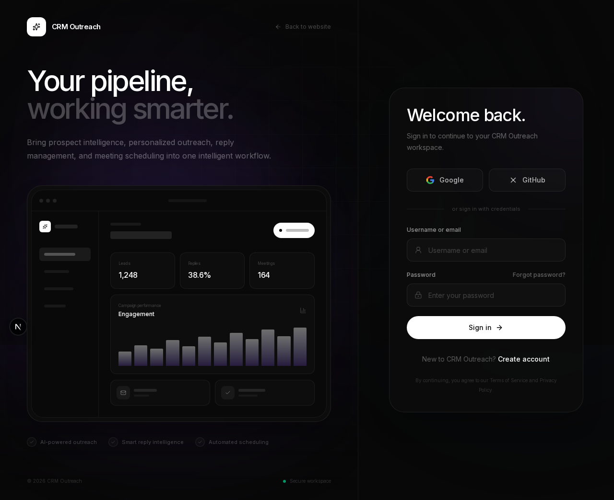
  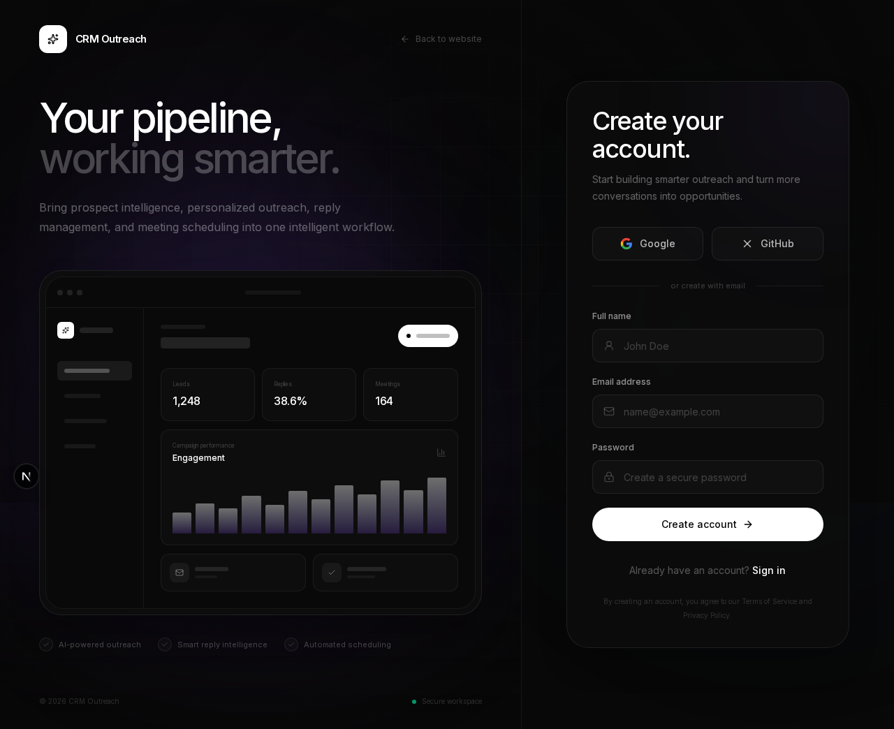
  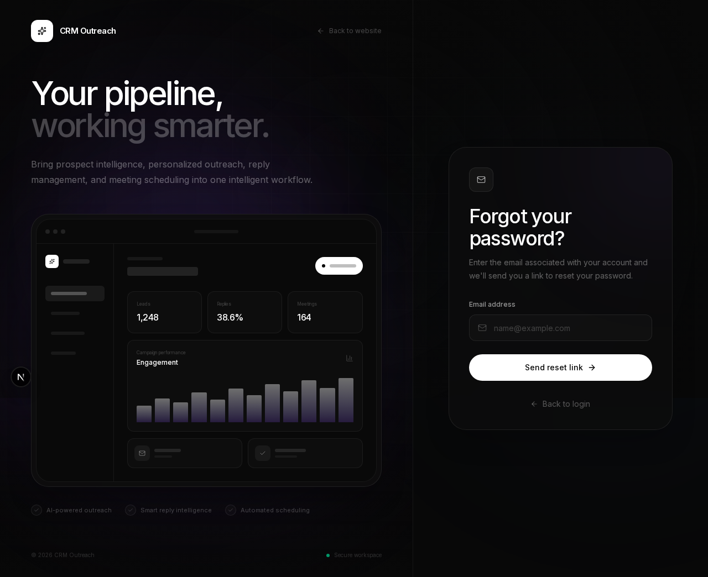
  <br />
  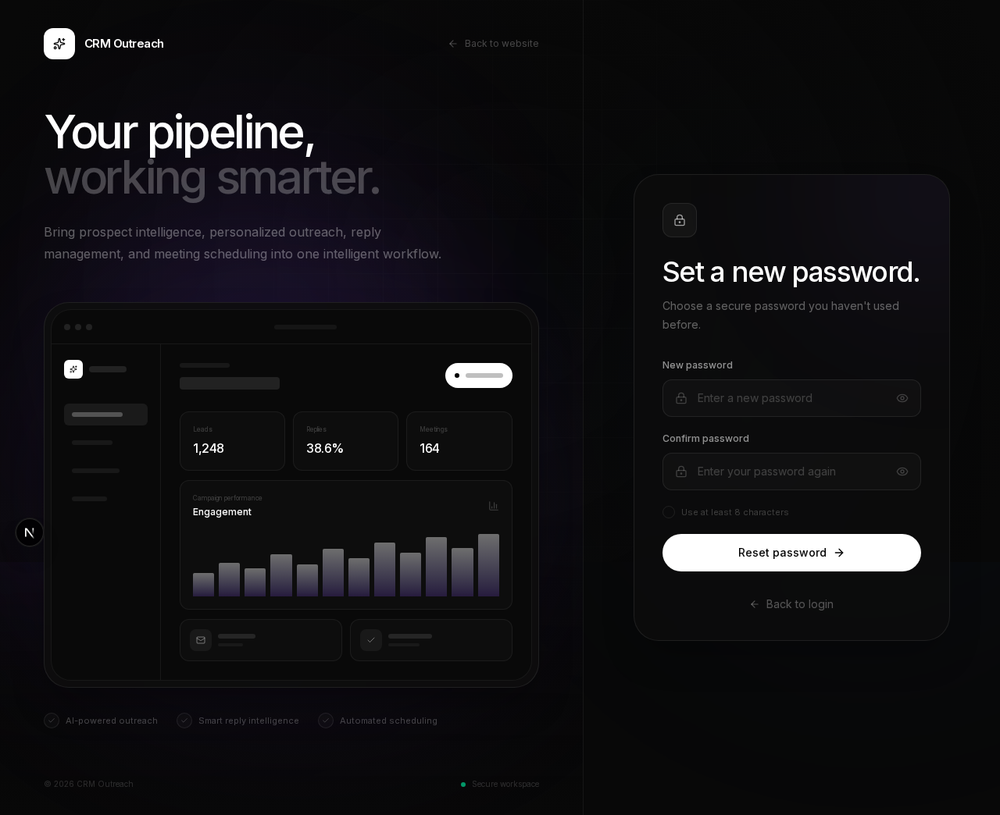
</div>

### Dashboard Experience

<div align="center">
  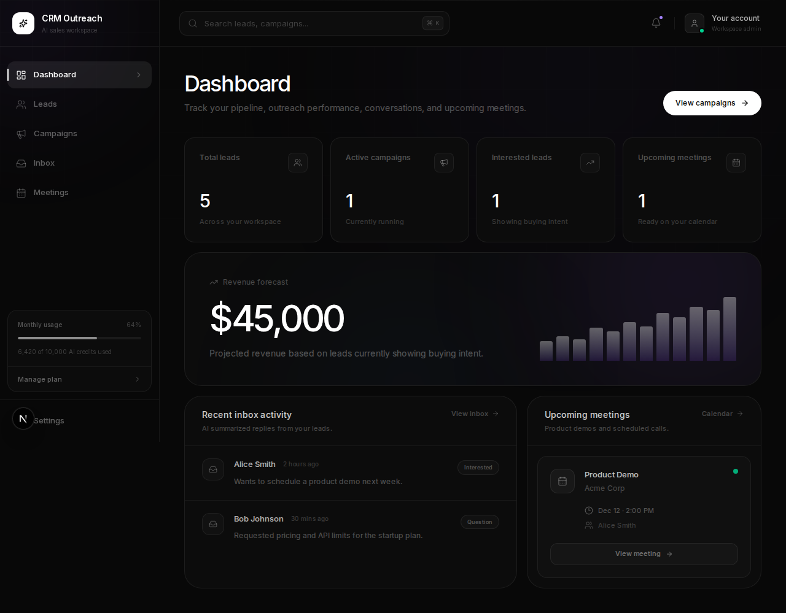
  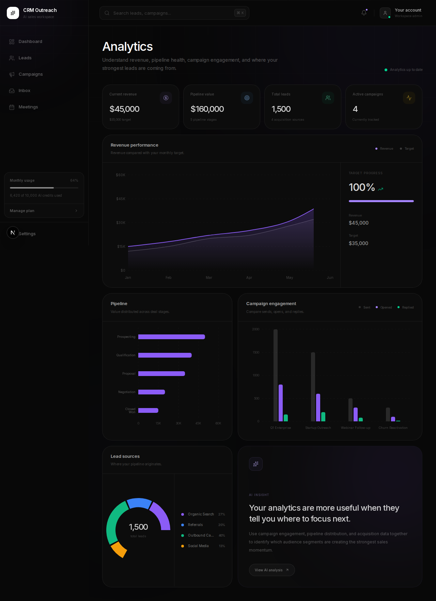
  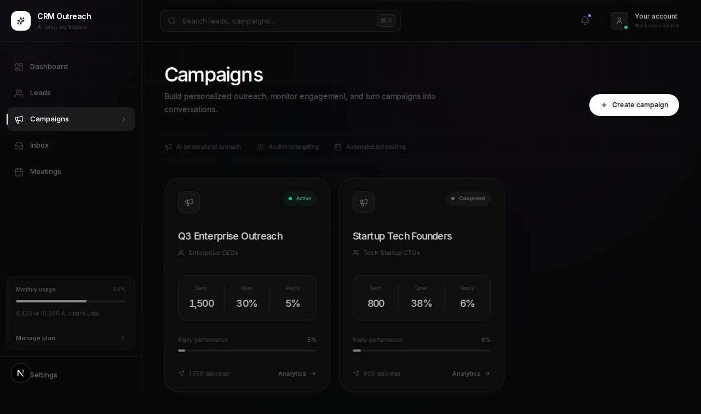
  <br />
  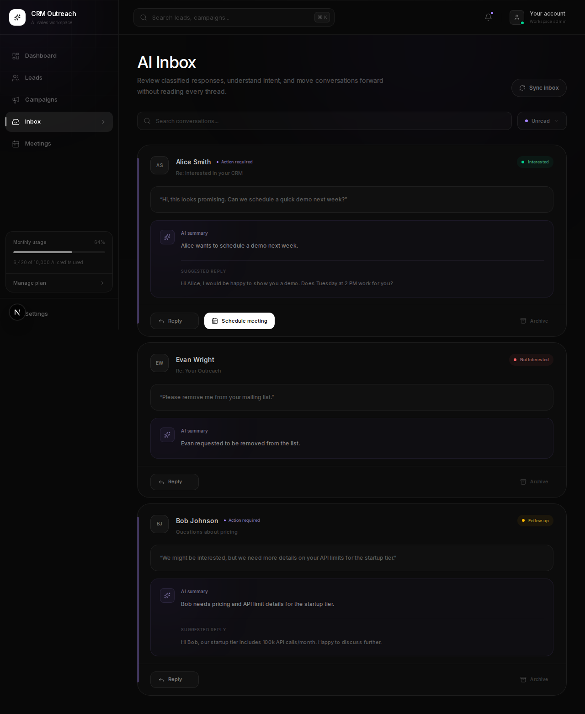
  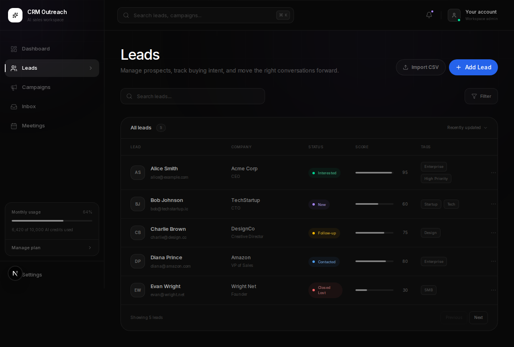
  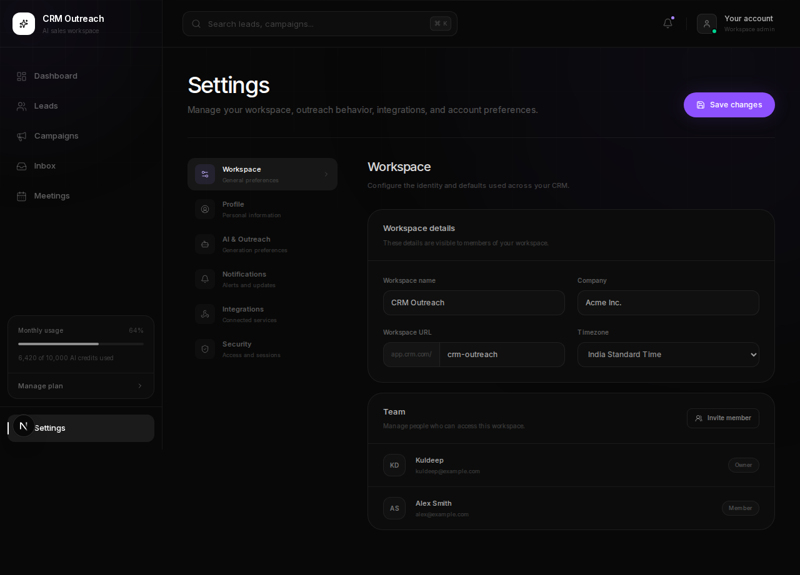
</div>

## ✨ Highlights

- Beautiful marketing pages with animated sections and smooth motion
- Secure auth flows for login, register, forgot password, and reset password
- A rich dashboard for analytics, campaigns, inbox, leads, meetings, and settings
- Responsive UI designed for desktop and mobile experiences
- Reusable component system with polished forms, cards, and layout primitives

## 🧰 Tech Stack

- Next.js 16 App Router
- React 19
- Tailwind CSS v4
- GSAP + ScrollTrigger
- Lucide Icons
- React Hook Form + Zod
- TanStack Table
- Recharts

## 🚀 Getting Started

Install dependencies:

```bash
npm install
# or
bun install
# or
pnpm install
```

Start the development server:

```bash
npm run dev
# or
bun dev
```

Open [http://localhost:3000](http://localhost:3000) in your browser.

## 🛠️ Available Scripts

- `npm run dev` — start the Next.js development server
- `npm run build` — build the production app
- `npm run start` — start the production server after build
- `npm run lint` — run ESLint

## 📁 Project Structure

- `src/app` — application routes and page layouts
- `src/components` — reusable UI components and layout primitives
- `src/config` — app and integration configuration
- `src/database` — migrations, seed data, and MongoDB helpers
- `src/hooks` — custom React hooks
- `src/integrations` — third-party integration helpers
- `src/lib` — shared utilities, auth, API response helpers, and validation
- `src/modules` — feature-specific modules for auth, campaigns, leads, meetings, and more
- `src/providers` — React providers for auth, theme, and query state
- `src/store` — client-side state management stores

## 🌐 Deployment

This app can be deployed to Vercel, Bun Cloud, or any platform that supports Next.js.

```bash
npm run build
npm run start
```

## 📌 Embed on your site (Next.js)

If you want the video embedded in your deployed site (not the README), use a responsive iframe wrapper or a small React component. Example:

```tsx
// src/components/EmbedVideo.tsx
import React from "react";

export default function EmbedVideo() {
  return (
    <div style={{ position: "relative", paddingTop: "56.25%" /* 16:9 */ }}>
      <iframe
        src="https://www.youtube.com/embed/ynkMrjhZme4?si=A25i69-Qy5M0hWom"
        title="YouTube video player"
        allow="accelerometer; autoplay; clipboard-write; encrypted-media; gyroscope; picture-in-picture; web-share"
        referrerPolicy="strict-origin-when-cross-origin"
        style={{
          position: "absolute",
          top: 0,
          left: 0,
          width: "100%",
          height: "100%",
          border: 0,
        }}
        loading="lazy"
        allowFullScreen
      />
    </div>
  );
}
```

## 📝 Notes & Quick UI suggestions

Here are a few focused UI improvements you can apply quickly:

1. Hero & CTA
   - Make primary CTA higher-contrast, larger, and add subtle hover scale. Example Tailwind: `bg-indigo-600 hover:bg-indigo-700 text-white font-semibold rounded-md px-6 py-3 shadow-md transform transition-transform duration-200`.

2. Typography & spacing
   - Increase heading scale (e.g., `text-4xl sm:text-5xl`) and add consistent container padding (`px-6 md:px-12`).

3. Dashboard density
   - Use hover elevation (`hover:shadow-lg`), clickable rows with chevrons, and kebab menus for secondary actions.

4. Accessibility
   - Verify color contrast (WCAG AA), add reduced-motion preferences, and ensure form labels/aria attributes are present.

5. Charts & visuals
   - Add legends, tooltips, and responsive containers for Recharts; use colorblind-safe palettes.

If you'd like, I can: add the EmbedVideo component file to the repo, replace README in a specific branch (for example `v2`), or open a PR with these changes. Tell me which branch you'd like the README updated on (default branch is used if you don't specify) or whether to also add the component file.
